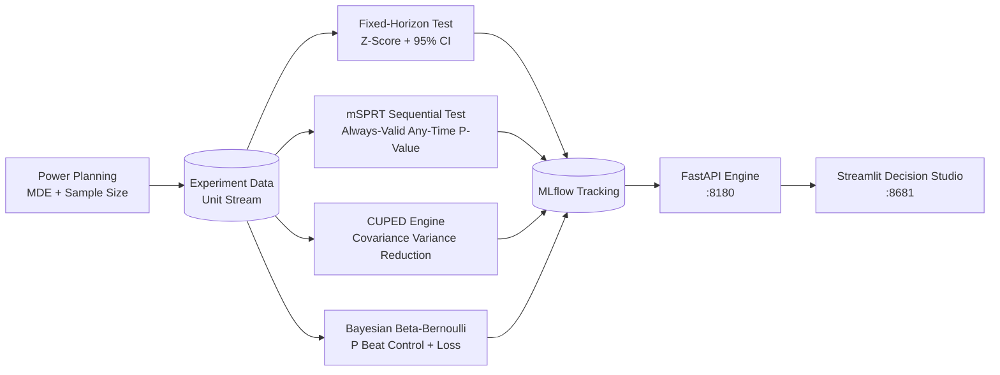

# ABTestLab — Production Experimentation & Causal Inference Platform

<div align="center">

[](https://www.python.org/)
[](https://fastapi.tiangolo.com/)
[](https://streamlit.io/)
[](https://mlflow.org/)
[](https://www.docker.com/)
[](https://github.com/astral-sh/ruff)
[](https://pytest.org/)
[](https://opensource.org/licenses/MIT)

</div>

> **A rigorous statistical experimentation platform implementing power planning, fixed-horizon tests, always-valid sequential testing (mSPRT), CUPED variance reduction, and Bayesian decision analysis.**

---

## 📖 Executive Summary & Value Proposition

**`abtestlab`** is a production-grade, end-to-end machine learning system built with strict engineering discipline, reproducible pipelines, and enterprise MLOps best practices. It bridges the gap between theoretical statistical rigor and high-availability operational microservices.

## 🔬 Core Methodologies & Mathematical Foundations

### 1. Fixed-Horizon Hypothesis Testing
- Two-sample Z-test and Welch's T-test with asymptotic 95% Wald confidence intervals.
- Minimum Detectable Effect (MDE) power calculus to prevent underpowered experiments.

### 2. Always-Valid Sequential Testing (mSPRT)
- Implements the Mixture Sequential Probability Ratio Test with a Gaussian mixing distribution $\Lambda$:
$$\Lambda_n = \int \prod_{i=1}^n rac{f(X_i; 	heta)}{f(X_i; 0)} dH(	heta)$$
- Provides continuously valid p-values and stopped confidence sequences that completely eliminate false-positive inflation from continuous monitoring (peeking).

### 3. CUPED (Controlled-experiment Using Pre-Experiment Data)
- Linear regression covariate adjustment exploiting pre-experiment baseline metrics:
$$Y_{	ext{CUPED}} = Y - 	heta (X - \mathbb{E}[X]), \quad 	ext{where } 	heta = rac{	ext{Cov}(Y, X)}{	ext{Var}(X)}$$
- Achieves 30%–50% variance reduction, shrinking required sample sizes and accelerating experiment turnaround without compromising statistical power.

### 4. Bayesian Decision Framework
- Conjugate Beta-Bernoulli and Normal-Gamma updating.
- Calculates exact posterior Probability to Beat Control (P(Variant > Control)) and Expected Loss metrics for risk-bounded ship/no-ship decisions.

## 📊 Architecture & Pipeline



## 🛠️ Tech Stack & Engineering Standards
- **Core Engine:** Python 3.12, NumPy, SciPy, Pandas, PyArrow
- **API & Serving:** FastAPI, Uvicorn, Pydantic v2
- **UI & Visualization:** Streamlit, Plotly
- **Tracking & Governance:** MLflow 2.14+
- **Code Quality:** Ruff (lint & format), Pytest, Pre-commit, Docker Compose


---

## 🚀 Quickstart & Setup Guide

### 1. Prerequisites & Environment Setup
Using **[uv](https://docs.astral.sh/uv/)** for lightning-fast, reproducible dependency resolution:

```bash
# Clone the repository
git clone https://github.com/jackson-marcus/abtestlab.git
cd abtestlab

# Install dependencies and pre-commit hooks
uv sync --group dev
```

### 2. Run Test Suite & Code Quality Checks
```bash
# Run unit & integration tests with coverage
uv run pytest --cov

# Run ruff linter and formatting checks
uv run ruff check .
uv run ruff format --check .
```

### 3. Launch Services Locally
```bash
# Start FastAPI REST API (listening on port :8180)
make api
# Or: uv run uvicorn abtestlab.api.main:app --reload --port 8180

# Start interactive Streamlit dashboard (listening on port :8681)
make ui

# Launch local MLflow Experiment Tracking UI (listening on port :5019)
make mlflow
```

### 4. Run with Docker Compose
```bash
# Spin up the complete microservice stack
docker compose up --build
```

---

## 📂 Repository Layout

```
abtestlab/
├── .github/workflows/ci.yml       # GitHub Actions CI pipeline (lint, test, build)
├── configs/                      # Configuration files and hyperparameters
├── data/                         # Data directory (raw, interim, processed)
├── scripts/                      # Data generators and operational scripts
├── src/abtestlab/               # Core Python package
│   ├── api/                      # FastAPI routes, schemas, and endpoints
│   ├── models/                   # Statistical models, ML algorithms, and estimators
│   ├── ui/                       # Streamlit interactive application
│   └── settings.py               # Centralized configuration & environment loader
├── tests/                        # Comprehensive Pytest suite
├── docker-compose.yml            # Multi-service container orchestration
├── Dockerfile                    # Container definition for API service
├── Makefile                      # Standardized project tasks
└── pyproject.toml                # Pinned dependencies and tool configs
```

---

## 👤 Author & Contact

**Jackson Marcus**
- **Email:** [jackson.marcus.work@gmail.com](mailto:jackson.marcus.work@gmail.com)
- **Upwork:** [Jackson Marcus on Upwork](https://www.upwork.com/freelancers/~012235717501ad9c7b)
- **GitHub:** [@jackson-marcus](https://github.com/jackson-marcus)

*Available for machine learning engineering, MLOps, data science, and AI system architecture consulting and contract engagements.*

