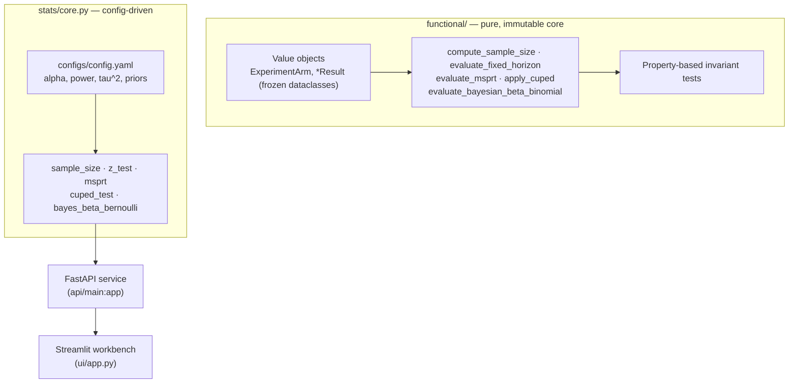

<div align="center">


</div>

# ABTestLab — Sequential Experimentation & Statistical Decision Engine

**Run A/B tests you can safely peek at.** ABTestLab is a small experimentation toolkit that plans experiments (power/sample size), analyses them with both a classical fixed-horizon test and an *always-valid* sequential test (mSPRT), reduces variance with CUPED, and turns the result into a Bayesian ship/no-ship decision — exposed as a FastAPI service and a Streamlit workbench.

<div align="center">

[](https://www.python.org/)
[](https://fastapi.tiangolo.com/)
[](https://pytest.org/)
[](https://opensource.org/licenses/MIT)

</div>

> **Portfolio project.** Built to demonstrate experimentation statistics and a pure-functional core with property-based tests. Runs on synthetic / user-supplied counts; not hardened for production use.

---

## The problem

Teams peek at running A/B tests. Someone opens the dashboard on day 3, sees `p < 0.05`, and ships. The trouble is that a classical fixed-horizon z-test is only valid **once**, at the sample size you committed to up front. Check it repeatedly and the false-positive rate climbs far past the nominal 5% — you "find" effects that aren't there.

ABTestLab addresses this directly: it plans the experiment properly, and it reports an **always-valid** sequential p-value alongside the fixed one, so continuous monitoring is safe by construction. It also reduces the variance of the metric (CUPED) and frames the decision in terms of risk (expected loss, probability of beating control) rather than a single p-value.

## What it does

- **Plan** — compute the per-arm sample size needed to detect a given relative lift at a target power.
- **Analyse (fixed horizon)** — two-proportion z-test with a confidence interval, valid at the planned sample size.
- **Monitor (sequential)** — a mixture Sequential Probability Ratio Test (mSPRT) whose p-value stays valid under continuous peeking.
- **Reduce variance** — CUPED uses a correlated pre-experiment covariate to strip out pre-existing noise.
- **Decide (Bayesian)** — Beta-Binomial posteriors give P(treatment beats control) and the expected loss of shipping.

## How it works

The statistics live in two layers. A **pure-functional core** (`functional/`) expresses every method as a total, side-effect-free function over immutable value objects, and is guarded by property-based invariant tests. A **config-driven service layer** (`stats/core.py`) wraps the same methods with defaults from `configs/config.yaml` and powers the API and UI.



## Statistical methods

### Sample size (two proportions)

Per-arm size to detect a relative lift, given baseline $p_1$, alternative $p_2 = p_1(1+\text{MDE})$, significance $\alpha$ and power $1-\beta$:

$$n = \frac{\left(z_{1-\alpha/2}\sqrt{2\bar p(1-\bar p)} + z_{1-\beta}\sqrt{p_1(1-p_1)+p_2(1-p_2)}\right)^2}{(p_2-p_1)^2}, \quad \bar p = \tfrac{p_1+p_2}{2}$$

### Fixed-horizon z-test

Pooled two-proportion z-test with a Wald confidence interval on the difference. Valid **only** at the pre-planned sample size — hence the sequential test below.

### Always-valid sequential test (mSPRT)

The mixture Sequential Probability Ratio Test mixes the likelihood ratio over a Gaussian prior on the effect ($\delta \sim \mathcal{N}(0,\tau^2)$), producing a running statistic $\Lambda_t$. The stopping rule and reported p-value are:

$$\text{stop and reject } H_0 \iff \Lambda_t \ge \frac{1}{\alpha}, \qquad p^{\text{always-valid}}_t = \min\left(1,\ \frac{1}{\Lambda_t}\right)$$

Because $\Lambda_t$ is a non-negative martingale under $H_0$, the Type-I error is bounded by $\alpha$ **no matter how often you look** — that is what makes peeking safe.

### CUPED variance reduction

Using a pre-experiment covariate $X$ correlated with the metric $Y$:

$$Y_{\text{CUPED}} = Y - \theta^\*(X - \mathbb{E}[X]), \qquad \theta^\* = \frac{\operatorname{Cov}(X,Y)}{\operatorname{Var}(X)}$$

The adjusted variance is $\operatorname{Var}(Y_{\text{CUPED}}) = \operatorname{Var}(Y)\,(1-\rho_{XY}^2)$, so the variance reduction equals $\rho_{XY}^2$ — a mathematical identity, not a benchmark. Since required sample size scales with metric variance, a more correlated covariate means a shorter experiment.

### Bayesian Beta-Binomial decision

Conjugate Beta priors give posteriors $\theta \sim \text{Beta}(\alpha_0 + k,\ \beta_0 + n - k)$ per arm. Monte-Carlo sampling then yields the decision metrics:

$$P(\theta_B > \theta_A), \qquad \mathbb{E}\big[\max(0,\ \theta_A - \theta_B)\big] \ \text{(expected loss if you ship B)}$$

### Pure-functional invariants

The `functional/` core is built so each method provably satisfies algebraic properties, which the test suite asserts directly:

1. **Bounded probability** — every reported probability stays in $[0, 1]$.
2. **CUPED reduction** — $\operatorname{Var}(Y_{\text{CUPED}}) \le \operatorname{Var}(Y)$ always.
3. **Sample-size monotonicity** — a smaller MDE requires a strictly larger sample.
4. **Bayesian monotonicity** — more treatment conversions strictly increase $P(\text{treatment} > \text{control})$.

## Getting started

```bash
make install                 # uv sync --group dev
make test                    # uv run pytest --cov

make api                     # FastAPI on http://localhost:8240
make ui                      # Streamlit workbench on http://localhost:8741
```

The UI reads `ABTESTLAB_API_URL` (defaults to `http://localhost:8240`); `make ui` sets it for you, so start the API first.

Or with Docker (API on `8240`, UI on `8741`):

```bash
make docker-up               # docker compose up --build -d
make docker-down
```

## API

Base URL `http://localhost:8240`. All analysis routes take conversion counts `{conversions_control, n_control, conversions_treatment, n_treatment}`.

| Method | Route | Purpose |
|---|---|---|
| `GET`  | `/health` | Liveness check |
| `POST` | `/power` | Per-arm sample size from `baseline_rate` + `mde_relative` |
| `POST` | `/analyze` | Fixed-horizon z-test: lift, p-value, 95% CI |
| `POST` | `/sequential` | mSPRT: likelihood ratio, always-valid p-value, `can_stop` |
| `POST` | `/bayes` | P(beat control), expected loss, lift percentiles |
| `POST` | `/cuped-demo` | Simulates a correlated pre-period metric and shows CUPED's variance reduction |

### Python usage (pure core)

```python
from abtestlab.functional import (
    ExperimentArm,
    compute_sample_size,
    evaluate_fixed_horizon,
    evaluate_msprt,
    evaluate_bayesian_beta_binomial,
)

# Plan
n = compute_sample_size(p_baseline=0.08, mde_relative=0.10, alpha=0.05, power=0.80)

# Immutable arms (validated on construction)
control = ExperimentArm(name="control", conversions=820, sample_size=10_000)
treatment = ExperimentArm(name="treatment", conversions=960, sample_size=10_000)

fixed = evaluate_fixed_horizon(control, treatment)          # .p_value, .ci_lower/upper
seq   = evaluate_msprt(control, treatment)                  # .should_stop_early, .likelihood_ratio
bayes = evaluate_bayesian_beta_binomial(control, treatment) # .p_treatment_beats_control
```

## Evaluation

There is no accuracy benchmark to quote — the methods are validated against statistical **theory and simulation**, which is what the test suite does:

- **Null calibration** — under a true null (both arms same rate), the fixed-horizon test flags significance at roughly the nominal 5%, and the mSPRT rarely stops early, over hundreds of simulated experiments.
- **Power** — on injected effects, both tests detect the lift and the mSPRT crosses its stopping boundary.
- **CUPED** — measured variance reduction matches the theoretical $\rho^2$.
- **Sample size** — reproduces the textbook ballpark (~31k/arm for a 5% baseline and 10% relative MDE).

Reproduce it all with:

```bash
make test                    # uv run pytest --cov
```

Simulation seeds are fixed in the tests, so results are deterministic on your machine.

## Testing

```bash
make test
```

- `tests/test_functional_invariants.py` — property-based invariants of the pure `functional/` core (bounds, monotonicity, CUPED reduction).
- `tests/test_stats.py` — theory/simulation checks of `stats/core.py` (null calibration, power, CUPED) plus FastAPI contract tests.

## Limitations

- Runs on synthetic simulations or user-supplied counts; there is no experiment assignment, logging, or data pipeline.
- Analysis assumes a single binary conversion metric per arm and independent observations.
- The mSPRT result depends on the mixture variance $\tau^2$ (`configs/config.yaml`); a poorly chosen prior trades detection speed for power.
- Bayesian outputs are Monte-Carlo estimates, so they carry small sampling noise.
- Two statistics implementations coexist (`functional/` and `stats/core.py`); the pure core is not yet wired into the API.

## Project structure

```
src/abtestlab/
├── functional/   # Pure, immutable statistics core + typed result objects
├── stats/        # Config-driven statistics powering the service layer
├── api/          # FastAPI app (main:app) and routes
├── ui/           # Streamlit workbench
└── settings.py   # Env + configs/config.yaml loading
```

## License

MIT

---

<div align="center">

**Jackson Marcus** · Senior AI & Machine Learning Engineer

[](https://github.com/jackson-marcus)
[](mailto:wajahatanees41@gmail.com)

</div>
