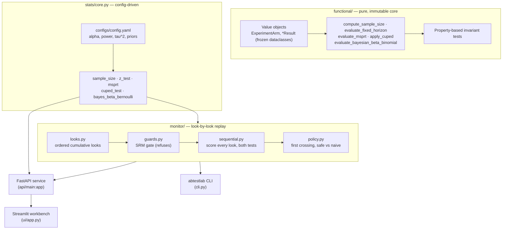

<div align="center">


</div>

# ABTestLab — Sequential Experimentation & Statistical Decision Engine

**Run A/B tests you can safely peek at.** ABTestLab plans experiments (power/sample size), then *replays a running one look by look* — checking assignment health, scoring every checkpoint with an *always-valid* sequential test (mSPRT), and telling you the first day you were entitled to stop. It also reduces variance with CUPED and frames the call as a Bayesian ship/no-ship decision. Exposed as a FastAPI service, a Streamlit workbench, and an `abtestlab` CLI.

<div align="center">

[](https://www.python.org/)
[](https://fastapi.tiangolo.com/)
[](https://pytest.org/)
[](https://opensource.org/licenses/MIT)

</div>

---

## The problem

Teams peek at running A/B tests. Someone opens the dashboard on day 3, sees `p < 0.05`, and ships. The trouble is that a classical fixed-horizon z-test is only valid **once**, at the sample size you committed to up front. Check it repeatedly and the false-positive rate climbs far past the nominal 5% — over 2000 simulated experiments read once a day for twelve days, [it reaches 21.3%](#what-peeking-actually-costs). One in five of those "wins" is noise.

ABTestLab addresses this directly. It plans the experiment properly, then replays the log of daily looks under an **always-valid** sequential rule that stays safe no matter how often you check — 1.2% on the same simulation. Before any of that it checks the assignment split, and refuses to report a lift at all if the split is broken. It also reduces the variance of the metric (CUPED) and frames the call in terms of risk (expected loss, probability of beating control) rather than a single p-value.

## What it does

- **Plan** — compute the per-arm sample size needed to detect a given relative lift at a target power.
- **Monitor a running test** — replay a chronological log of per-arm counts. Every look gets both an always-valid p-value and the fixed-horizon one, so you see the first look you could legitimately have stopped on *and* what a naive dashboard would have told you instead.
- **Refuse when assignment is broken** — a sample-ratio-mismatch gate runs on exposure counts before any conversion number is read. If the split does not match the design, the monitor reports no lift at all.
- **Analyse (fixed horizon)** — two-proportion z-test with a confidence interval, valid at the planned sample size.
- **Reduce variance** — CUPED uses a correlated pre-experiment covariate to strip out pre-existing noise.
- **Decide (Bayesian)** — Beta-Binomial posteriors give P(treatment beats control) and the expected loss of shipping.

## How it works

The statistics live in two layers. A **pure-functional core** (`functional/`) expresses every method as a total, side-effect-free function over immutable value objects, and is guarded by property-based invariant tests. A **config-driven service layer** (`stats/core.py`) wraps the same methods with defaults from `configs/config.yaml`. On top of that sits **`monitor/`**, which is where a single set of counts becomes a running experiment: an ordered sequence of looks, a gate that can refuse it, and a stopping rule that names the day.



## Monitoring a running experiment

The rest of this package answers "given these final counts, is the difference
real?". `monitor/` answers the question people actually ask mid-flight: *we have
been looking at this every morning — may we stop yet, and did we already miss
the moment?*

Feed it an observation log (one row per day, per-arm cumulative or incremental
counts) and it walks the log in order:

1. **`looks.py`** builds the ordered cumulative sequence and rejects logs that
   cannot be an experiment — a cumulative count that moves backwards (an ETL
   re-run that dropped rows), conversions above exposures, an arm with no
   traffic.
2. **`guards.py`** runs a chi-square sample-ratio-mismatch test on exposure
   counts only, at a deliberately strict `p < 0.001`. An SRM check runs on every
   experiment on every look, so at 0.05 a healthy programme would drown in false
   alarms — measured in `tests/test_monitor.py`, the 0.05 threshold fires far
   more often than 0.001 on 400 simulated *fair* splits.
3. **`sequential.py`** scores each look twice: the always-valid mSPRT p-value and
   the fixed-horizon z-test p-value.
4. **`policy.py`** applies two stopping rules and reports both — the peek-safe
   one, and the one an unguarded dashboard invites.
5. **`run.py`** turns that into `ship` / `roll_back` / `keep_running` /
   `refused_srm`, with the Bayesian expected loss attached at the deciding look.

A failed SRM gate short-circuits everything. No lift, no p-value, no
recommendation — a confounded estimate that *looks* usable is worse than
silence.

```bash
uv run abtestlab monitor data/example_looks.csv   # replay + recommendation
uv run abtestlab srm data/example_looks_srm.csv   # gate only; exit 1 if broken
```

### Why the report names the *first* crossing, not the current p-value

$\Lambda_t$ is a martingale, so the always-valid p-value is **not monotone**: it
can drop below $\alpha$ and drift back up. The anytime-valid guarantee is a
statement about the stopping rule *"stop the first time $p_t < \alpha$"*, not
about the p-value at the last look you happened to take.

This is not a corner case. In the committed example log
(`data/example_looks.csv`, 14 days, 4000 units/arm/day, simulated) the
always-valid p-value crosses on day 3 at **0.0357**, then rebounds to **0.0809**
on day 4 before settling. A dashboard that only shows today's number would have
declared the test significant, then un-declared it, then re-declared it on day 5.

Measured over 2000 simulated experiments with a true +10% lift, **32.4% of the
runs the always-valid rule stopped were back above $\alpha$ by the final look**.
Reporting only the current status would silently discard about a third of the
wins the rule already entitled you to.

## Statistical methods

### Sample size (two proportions)

Per-arm size to detect a relative lift, given baseline $p_1$, alternative $p_2 = p_1(1+\text{MDE})$, significance $\alpha$ and power $1-\beta$:

$$n = \frac{\left(z_{1-\alpha/2}\sqrt{2\bar p(1-\bar p)} + z_{1-\beta}\sqrt{p_1(1-p_1)+p_2(1-p_2)}\right)^2}{(p_2-p_1)^2}, \quad \bar p = \tfrac{p_1+p_2}{2}$$

### Fixed-horizon z-test

Pooled two-proportion z-test with a Wald confidence interval on the difference. Valid **only** at the pre-planned sample size — hence the sequential test below.

### Always-valid sequential test (mSPRT)

The mixture Sequential Probability Ratio Test mixes the likelihood ratio over a Gaussian prior on the effect ($\delta \sim \mathcal{N}(0,\tau^2)$), producing a running statistic $\Lambda_t$. The stopping rule and reported p-value are:

$$\text{stop and reject } H_0 \iff \Lambda_t \ge \frac{1}{\alpha}, \qquad p^{\text{always-valid}}_t = \min\left(1,\ \frac{1}{\Lambda_t}\right)$$

Because $\Lambda_t$ is a non-negative martingale under $H_0$, the Type-I error is bounded by $\alpha$ **no matter how often you look** — that is what makes peeking safe.

### CUPED variance reduction

Using a pre-experiment covariate $X$ correlated with the metric $Y$:

$$Y_{\text{CUPED}} = Y - \theta^\*(X - \mathbb{E}[X]), \qquad \theta^\* = \frac{\operatorname{Cov}(X,Y)}{\operatorname{Var}(X)}$$

The adjusted variance is $\operatorname{Var}(Y_{\text{CUPED}}) = \operatorname{Var}(Y)\,(1-\rho_{XY}^2)$, so the variance reduction equals $\rho_{XY}^2$ — a mathematical identity, not a benchmark. Since required sample size scales with metric variance, a more correlated covariate means a shorter experiment.

### Bayesian Beta-Binomial decision

Conjugate Beta priors give posteriors $\theta \sim \text{Beta}(\alpha_0 + k,\ \beta_0 + n - k)$ per arm. Monte-Carlo sampling then yields the decision metrics:

$$P(\theta_B > \theta_A), \qquad \mathbb{E}\big[\max(0,\ \theta_A - \theta_B)\big] \ \text{(expected loss if you ship B)}$$

### Pure-functional invariants

The `functional/` core is built so each method provably satisfies algebraic properties, which the test suite asserts directly:

1. **Bounded probability** — every reported probability stays in $[0, 1]$.
2. **CUPED reduction** — $\operatorname{Var}(Y_{\text{CUPED}}) \le \operatorname{Var}(Y)$ always.
3. **Sample-size monotonicity** — a smaller MDE requires a strictly larger sample.
4. **Bayesian monotonicity** — more treatment conversions strictly increase $P(\text{treatment} > \text{control})$.

## Getting started

```bash
make install                 # uv sync --group dev
make test                    # uv run pytest --cov

make api                     # FastAPI on http://localhost:8240
make ui                      # Streamlit workbench on http://localhost:8741

make replay                  # uv run abtestlab monitor data/example_looks.csv
```

`make replay` needs no server: it walks the committed example log and prints the
per-look table and the recommendation.

The UI reads `ABTESTLAB_API_URL` (defaults to `http://localhost:8240`); `make ui` sets it for you, so start the API first.

Or with Docker (API on `8240`, UI on `8741`):

```bash
make docker-up               # docker compose up --build -d
make docker-down
```

## API

Base URL `http://localhost:8240`. All analysis routes take conversion counts `{conversions_control, n_control, conversions_treatment, n_treatment}`.

| Method | Route | Purpose |
|---|---|---|
| `GET`  | `/health` | Liveness check |
| `POST` | `/power` | Per-arm sample size from `baseline_rate` + `mde_relative` |
| `POST` | `/analyze` | Fixed-horizon z-test: lift, p-value, 95% CI |
| `POST` | `/sequential` | mSPRT: likelihood ratio, always-valid p-value, `can_stop` |
| `POST` | `/bayes` | P(beat control), expected loss, lift percentiles |
| `POST` | `/cuped-demo` | Simulates a correlated pre-period metric and shows CUPED's variance reduction |
| `POST` | `/monitor` | Replays an ordered observation log: SRM gate, per-look sequential + fixed p-values, both stopping rules, decision |

### Monitoring a log

```bash
curl -s localhost:8240/monitor -H 'content-type: application/json' -d '{
  "looks": [
    {"label": "day-1", "conversions_control": 200, "n_control": 4000,
     "conversions_treatment": 214, "n_treatment": 4000},
    {"label": "day-2", "conversions_control": 405, "n_control": 8000,
     "conversions_treatment": 461, "n_treatment": 8000}
  ]
}'
```

Set `"cumulative": false` if your rows are per-period increments rather than
running totals.

### Command line

```bash
uv run abtestlab monitor data/example_looks.csv     # full replay table + decision
uv run abtestlab srm     data/example_looks.csv     # assignment gate only
```

`abtestlab srm` exits 1 on a sample-ratio mismatch, so it drops straight into CI
over an experiment export: it touches exposure counts only and never reads a
conversion number.

### Python usage (pure core)

```python
from abtestlab.functional import (
    ExperimentArm,
    compute_sample_size,
    evaluate_fixed_horizon,
    evaluate_msprt,
    evaluate_bayesian_beta_binomial,
)

# Plan
n = compute_sample_size(p_baseline=0.08, mde_relative=0.10, alpha=0.05, power=0.80)

# Immutable arms (validated on construction)
control = ExperimentArm(name="control", conversions=820, sample_size=10_000)
treatment = ExperimentArm(name="treatment", conversions=960, sample_size=10_000)

fixed = evaluate_fixed_horizon(control, treatment)          # .p_value, .ci_lower/upper
seq   = evaluate_msprt(control, treatment)                  # .should_stop_early, .likelihood_ratio
bayes = evaluate_bayesian_beta_binomial(control, treatment) # .p_treatment_beats_control
```

## Evaluation

There is no accuracy benchmark to quote — the methods are validated against statistical **theory and simulation**, which is what the test suite does:

- **Null calibration** — under a true null (both arms same rate), the fixed-horizon test flags significance at roughly the nominal 5%, and the mSPRT rarely stops early, over hundreds of simulated experiments.
- **Power** — on injected effects, both tests detect the lift and the mSPRT crosses its stopping boundary.
- **CUPED** — measured variance reduction matches the theoretical $\rho^2$.
- **Sample size** — reproduces the textbook ballpark (~31k/arm for a 5% baseline and 10% relative MDE).

### What peeking actually costs

`scripts/peeking_calibration.py` simulates whole experiments as look sequences
and applies the shipped stopping rules from `monitor/policy.py` to each one.
Defaults: 2000 experiments per scenario, 12 looks each, 1500 new units per arm
per look, 5% baseline, alpha 0.05, seed 20240.

```bash
uv run python scripts/peeking_calibration.py
```

| scenario | naive peek | always-valid | read once at the end |
|---|---:|---:|---:|
| true null | **21.3%** | **1.2%** | 0.2% |
| true +10% lift | 69.7% | **24.2%** | 16.4% |

*naive peek* = stop the first look where the fixed-horizon p < alpha.
*always-valid* = stop the first look where the mSPRT p < alpha.

Reading a fixed-horizon p-value every morning turns a nominal 5% false-positive
rate into **21.3%** — one in five of those "wins" is noise. The always-valid rule
peeks just as often and stays at 1.2%, comfortably inside its own bound. It also
buys real detection for the privilege: 24.2% of true +10% lifts against 16.4%
for a single look at the end, on the same data.

(The 69.7% naive figure under a true lift is not power. Roughly a fifth of it is
the same error the null row measures.)

Reproduce the rest with:

```bash
make test                    # uv run pytest --cov
```

Simulation seeds are fixed in the tests and in the script, so results are
deterministic on your machine.

## Testing

```bash
make test
```

- `tests/test_functional_invariants.py` — property-based invariants of the pure `functional/` core (bounds, monotonicity, CUPED reduction).
- `tests/test_stats.py` — theory/simulation checks of `stats/core.py` (null calibration, power, CUPED) plus FastAPI contract tests.
- `tests/test_monitor.py` — the monitor's decisions: which look each rule fires on, that a broken split produces no lift at all, that a backwards cumulative log is rejected, that the always-valid p-value really is non-monotone, and that naive peeking measurably inflates the false-positive rate.

## Limitations

- There is no assignment or bucketing service here. You bring the observation log; ABTestLab reads it, checks it, and decides. The example logs under `data/` are simulated (`scripts/make_example_logs.py`).
- Analysis assumes a single binary conversion metric per arm and independent observations.
- The SRM gate tests the split at the final look only. A split that breaks mid-experiment and self-corrects will pass it.
- The mSPRT result depends on the mixture variance $\tau^2$ (`configs/config.yaml`); a poorly chosen prior trades detection speed for power. The monitor inherits that choice - the 24.2% detection figure above is for the shipped $\tau^2$ = 10^-4, not a property of sequential testing in general.
- Bayesian outputs are Monte-Carlo estimates, so they carry small sampling noise.
- Two statistics implementations coexist (`functional/` and `stats/core.py`); the API and the monitor both use `stats/core.py`, and the pure core is still library-only.

## Project structure

```
src/abtestlab/
├── functional/   # Pure, immutable statistics core + typed result objects
├── stats/        # Config-driven statistics powering the service layer
├── monitor/      # Look-by-look replay: looks, SRM gate, per-look tests, stopping policy
├── api/          # FastAPI app (main:app) and routes
├── ui/           # Streamlit workbench
├── cli.py        # `abtestlab monitor` / `abtestlab srm`
└── settings.py   # Env + configs/config.yaml loading

scripts/
├── peeking_calibration.py   # measures the table in "What peeking actually costs"
└── make_example_logs.py     # regenerates data/example_looks*.csv
```

## License

MIT

---

<div align="center">

**Jackson Marcus** · Senior AI & Machine Learning Engineer

[](https://github.com/jackson-marcus)
[](mailto:wajahatanees41@gmail.com)

</div>
