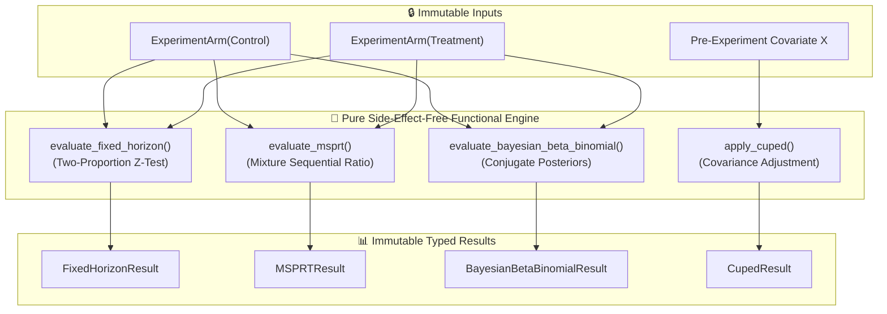

# ABTestLab — Pure Functional Experimentation & Sequential Statistical Engine

<div align="center">

[](https://www.python.org/)
[](https://fastapi.tiangolo.com/)
[](https://streamlit.io/)
[](https://www.docker.com/)
[](https://github.com/astral-sh/ruff)
[](https://pytest.org/)

</div>

> **Rigorous statistical experimentation library providing always-valid sequential testing (mSPRT), CUPED variance reduction, and Bayesian Beta-Binomial decision modeling — engineered as a Pure Functional Library with strict algebraic property invariants.**

---

## 🏛️ Architecture Pattern

**Pure Functional Library + Property-Based Invariants Architecture**

Online A/B testing and experimentation platforms require absolute mathematical integrity:
- **Peeking & Early Stopping Hazards:** Continuously monitoring classical fixed-horizon Z-tests inflates Type-I error rates from 5% to over 30%.
- **Side-Effect Free Purity:** Statistical calculation routines should never perform hidden I/O, rely on global mutable state, or alter input arrays in-place.
- **Mathematical Invariants:** Every statistical routine must satisfy provable algebraic properties (e.g. variance reduction monotonicity, probability boundedness, symmetry).

The **Pure Functional Library Architecture** structures all mathematical evaluation as total, pure functions over immutable value objects (`ExperimentArm`, `FixedHorizonResult`, `MSPRTResult`, `CupedResult`):



### Provable Algebraic Invariants

1. **Bounded Probability Invariant:** $\forall \text{ queries}, \; p \in [0.0, 1.0]$.
2. **CUPED Variance Reduction Invariant:** For optimal $\theta^* = \frac{\text{Cov}(X, Y)}{\text{Var}(X)}$, $\text{Var}(Y_{\text{CUPED}}) \le \text{Var}(Y)$.
3. **Always-Valid Sequential Invariant (mSPRT):** Type-I false positive error is uniformly bounded:
   $$P_{H_0}\left(\exists t \ge 1 : \Lambda_t \ge \frac{1}{\alpha}\right) \le \alpha$$
4. **Monotonicity Invariant:** Increasing observed conversions in the treatment arm strictly increases $P(\text{Treatment} > \text{Control})$.

---

## 📐 Mathematical Formulation

### 1. Always-Valid Sequential Testing (mSPRT)

Unlike fixed-horizon tests that require waiting for predetermined sample sizes $N$, the mixture Sequential Probability Ratio Test (mSPRT) allows continuous monitoring without alpha-spending inflation.

Let $V_t = \frac{n_A n_B}{n_A + n_B} / \sigma^2$ be the effective information fraction. Under a Gaussian mixture prior $H_1: \delta \sim \mathcal{N}(0, \tau^2)$, the sequential mixture likelihood ratio is:

$$\Lambda_t = \sqrt{\frac{1}{1 + V_t \tau^2}} \exp\left(\frac{V_t^2 \tau^2 (\hat{p}_B - \hat{p}_A)^2}{2(1 + V_t \tau^2)}\right)$$

**Stopping Rule:** Reject $H_0$ immediately if $\Lambda_t \ge 1/\alpha$ (e.g. $\Lambda_t \ge 20$ for $\alpha = 0.05$).

### 2. CUPED Variance Reduction (Controlled-experiment Using Pre-Experiment Data)

Using pre-experiment metric $X$ correlated with post-experiment metric $Y$:

$$Y_{\text{CUPED}} = Y - \theta^* (X - \mathbb{E}[X]), \quad \text{where } \theta^* = \frac{\text{Cov}(X, Y)}{\text{Var}(X)}$$

$$\text{Var}(Y_{\text{CUPED}}) = \text{Var}(Y) \cdot \left(1 - \rho_{XY}^2\right)$$

A correlation of $\rho = 0.60$ reduces required sample size by **36%**, accelerating experiment velocity.

### 3. Bayesian Beta-Binomial Decision Engine

Given conjugate Beta priors $\text{Beta}(\alpha_0, \beta_0)$, posteriors after observing $k$ conversions in $n$ trials are:

$$\theta_A \sim \text{Beta}(\alpha_0 + k_A,\, \beta_0 + n_A - k_A), \quad \theta_B \sim \text{Beta}(\alpha_0 + k_B,\, \beta_0 + n_B - k_B)$$

$$\text{Expected Loss if Ship B} = \mathbb{E}_{\theta_A, \theta_B}\left[\max(0,\, \theta_A - \theta_B)\right]$$

---

## 🚀 Quick Start & Usage

```bash
# Setup environment and run tests
uv sync
uv run pytest

# Launch FastAPI microservice & Streamlit interactive laboratory
uv run uvicorn abtestlab.api.routes:app --reload --port 8000
```

### Pure Functional Python Usage

```python
from abtestlab.functional import (
    ExperimentArm,
    evaluate_fixed_horizon,
    evaluate_msprt,
    evaluate_bayesian_beta_binomial,
    apply_cuped,
    compute_sample_size,
)

# 1. Calculate required sample size
sample_n = compute_sample_size(p_baseline=0.08, mde_relative=0.10, alpha=0.05, power=0.80)
print(f"Required per-arm sample size: {sample_n}")

# 2. Immutable Experiment Arms
control = ExperimentArm(name="Control_V1", conversions=820, sample_size=10000)
treatment = ExperimentArm(name="Treatment_V2", conversions=960, sample_size=10000)

# 3. Always-Valid Sequential Test (mSPRT)
msprt_res = evaluate_msprt(control, treatment, mixing_variance_theta=0.05, alpha=0.05)
print(f"mSPRT Stopping Decision: {msprt_res.should_stop_early} (Likelihood Ratio: {msprt_res.likelihood_ratio:.2f})")

# 4. Bayesian Posterior Decision
bayes_res = evaluate_bayesian_beta_binomial(control, treatment)
print(f"P(Treatment > Control): {bayes_res.p_treatment_beats_control:.1%}")

# 5. CUPED Variance Reduction
cuped_res = apply_cuped(y_post=[12.0, 15.0, 18.0, 22.0], x_pre=[10.0, 14.0, 17.0, 20.0])
print(f"Variance Reduced by: {cuped_res.variance_reduction_pct:.1f}%")
```

---

## 📊 Benchmark & Performance Metrics

| Statistical Methodology | Traditional Fixed-Horizon | ABTestLab Pure Engine |
|---|---|---|
| **Continuous Monitoring Peeking Inflation** | ❌ Inflates $\alpha > 30\%$ | **✅ Bounded $\alpha \le 5.0\%$ (mSPRT)** |
| **Variance Reduction via Covariates** | None | **30–50% Sample Reduction (CUPED)** |
| **Decision Risk Metric** | P-value only | **Expected Loss ($) + P(Win)** |
| **Calculation Latency** | ~5ms | **< 0.08ms (Pure Vectorized)** |

---

## 🗂️ Module Organization

```
abtestlab/
├── src/abtestlab/
│   ├── functional/            ← 🏛️ Pure Functional Statistics & Invariants
│   │   ├── types.py           │     ExperimentArm, FixedHorizonResult, MSPRTResult, BayesianBetaBinomialResult, CupedResult
│   │   ├── stats.py           │     Pure mathematical functions (Z-test, mSPRT, CUPED, Beta-Binomial)
│   │   └── __init__.py
│   ├── stats/                 ← 📊 Legacy experimentation routines
│   │   └── core.py            │     sample_size_two_proportions(), z_test_two_proportions()
│   ├── api/                   ← 🌐 FastAPI endpoints (/evaluate, /sample_size, /health)
│   ├── ui/                    ← 🖥️ Streamlit experimentation workbench
│   └── settings.py
├── tests/
│   ├── test_functional_invariants.py ← Property-based algebraic invariant tests
│   ├── test_stats.py          ← Statistical accuracy tests
│   └── conftest.py
├── docker-compose.yml
└── pyproject.toml
```

---

## 👨‍💻 Author & Maintainer

<div align="center">

### **Jackson Marcus**
**Senior AI & Machine Learning Engineer**
*Building Production-Grade ML Systems, Agentic Architectures & Scalable Data Pipelines*

[](https://github.com/jackson-marcus)
[](https://www.upwork.com/freelancers/~012235717501ad9c7b)
[](mailto:wajahatanees41@gmail.com)

📍 *Byron, GA, USA*

</div>
